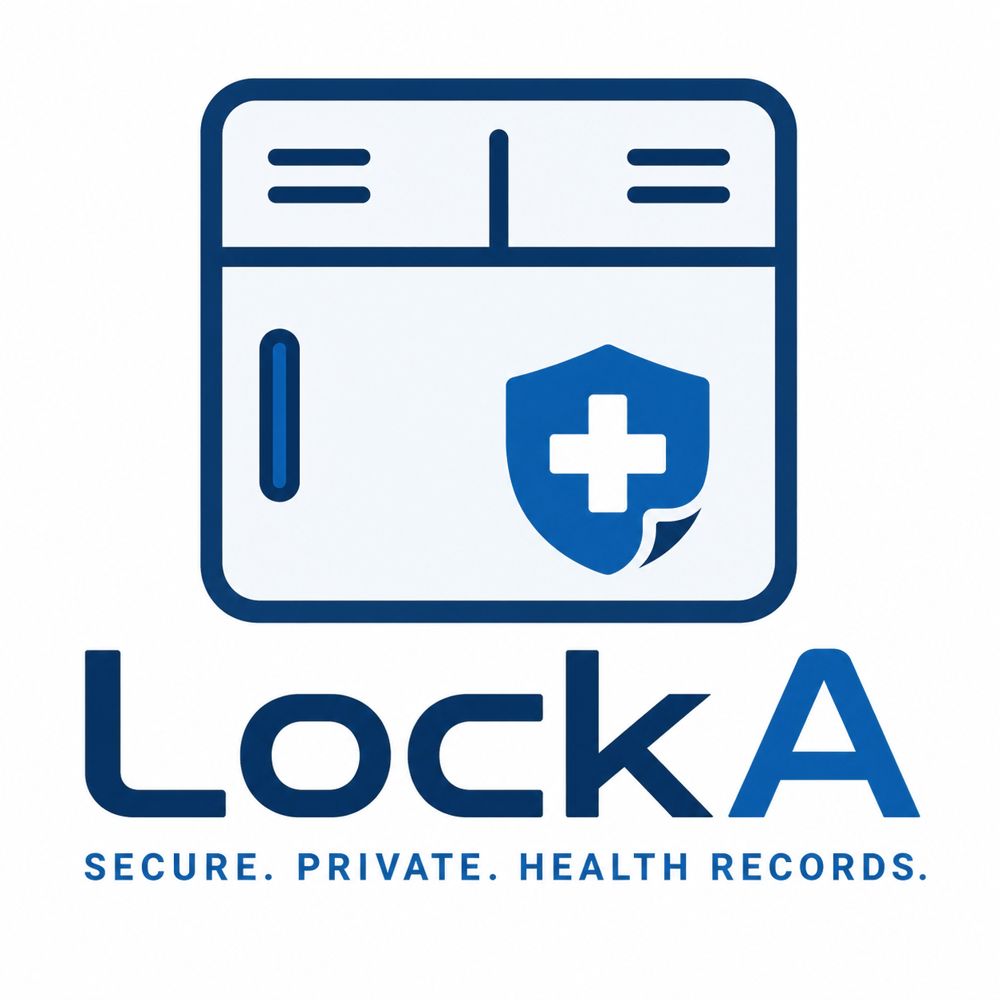

# LockA Medical Passport - To Democratize Healthcare

A patient-controlled digital health passport for secure, private, interoperable, and verifiable medical records.

## Table of Contents

- 1. Executive Summary
- 2. Problem Statement
- 3. Product Vision and Objectives
- 4. Core Users and Stakeholders
- 5. Platform Model
- 6. High-Level Architecture
- 7. Technology Stack
- 8. Stellar Blockchain Design
- 9. Zero-Knowledge Identity and Access Control
- 10. Data Storage, Records, and Privacy
- 11. IoT, Wearables, and Medical Device Data
- 12. AI-Assisted Healthcare Workflows
- 13. Key User Flows
- 14. Repository Structure
- 15. MVP Scope
- 16. Security, Compliance, and Ethical Considerations
- 17. Open-Source Contribution Readiness
- 18. Roadmap
- 19. Selected Technical References

## 1. Executive Summary

LockA Medical Passport is a decentralized digital health identity and medical records platform designed to give patients direct control over their healthcare data. The product is inspired by the concept of a school locker: a safe, personal space where a student keeps important items. LockA applies that same idea to healthcare by creating a secure digital locker for medical records, where the patient decides who can access their health information, for what purpose, and for how long.

The platform addresses a major healthcare challenge: fragmented, inaccessible, and poorly portable medical records. Many patients move between clinics, hospitals, laboratories, pharmacies, and countries without a reliable medical history. This leads to repeated tests, delayed treatment, weak continuity of care, poor emergency response, and higher medical costs. LockA provides a single patient-controlled health passport that can hold verified records such as diagnoses, prescriptions, laboratory results, allergies, vaccination records, treatment notes, imaging references, insurance credentials, and consent logs.

This version of LockA Medical Passport is designed on the Stellar blockchain using Soroban smart contracts, off-chain encrypted data storage, Zero-Knowledge Proofs for identity and privacy-preserving access control, and AI-assisted workflows for medical summaries and compliance checks. Medical data is not stored directly on-chain. Instead, Stellar is used as the trust, permission, audit, and verification layer, while sensitive records remain encrypted in secure off-chain storage controlled by patient consent.

## 2. Problem Statement

Healthcare delivery in many African markets is constrained by data fragmentation. A patient may receive care from a local clinic, then visit a state hospital, a private laboratory, a pharmacy, an insurance provider, or a specialist in another city. In many cases, those providers do not share a common records infrastructure. Patients often rely on paper files, screenshots, verbal explanations, or repeated diagnostic tests.

This creates practical and clinical problems:

- Loss of medical history: Important information such as allergies, previous diagnoses, medications, and chronic conditions may be missing when the patient seeks care.
- Repeated tests and higher costs: Patients may pay for the same tests multiple times because providers cannot verify previous results.
- Weak emergency response: Emergency providers may not know a patient's blood type, allergies, current medications, or relevant conditions.
- Poor interoperability: Hospitals, clinics, labs, pharmacies, and insurers often operate separate systems with no common patient-controlled access layer.
- Privacy risk: Paper records, manual files, screenshots, and unencrypted transfers expose sensitive medical data.
- Limited trust: Providers may struggle to verify whether a document, lab result, or credential is authentic and unaltered.

> **Core Problem**
>
> Patients need a secure, portable, verifiable, and privacy-preserving way to control their medical records across providers, systems, and borders.

## 3. Product Vision and Objectives

The vision of LockA Medical Passport is to become a trusted digital health infrastructure layer, enabling every patient to carry a secure and verifiable medical passport that can be accessed anywhere only with patient permission.

### 3.1 Product Objectives

- Patient ownership: Give patients control over their medical identity, consent, and health record sharing.
- Provider trust: Allow hospitals, clinics, laboratories, pharmacies, and insurers to verify approved records without relying on informal document exchange.
- Privacy by design: Use encryption and Zero-Knowledge Proofs so patients can prove important facts without exposing unnecessary health data.
- Interoperability: Create a shared access layer that works across different healthcare providers and future third-party systems.
- Auditability: Create a transparent record of who requested access, who approved access, and which provider updated a patient record.
- Open-source contribution: Make the project understandable, modular, testable, and suitable for community review and collaboration.

## 4. Core Users and Stakeholders

| Stakeholder | Role in LockA |
| --- | --- |
| Patients | Create and control the medical passport, approve access, revoke access, view records, and share QR-based access requests. |
| Hospitals and Clinics | Request approved access, view relevant patient history, add treatment notes, and verify record authenticity. |
| Doctors and Health Workers | Review patient summaries, view consented records, and update visit outcomes. |
| Laboratories and Diagnostic Centers | Upload lab results, sign results, and attach verifiable record hashes to patient passports. |
| Pharmacies | Verify prescriptions, update medication fulfillment records, and reduce prescription fraud. |
| Insurance Providers | Verify eligibility, claims, and coverage status through privacy-preserving proofs. |
| Government and Public Health Agencies | Use permissioned, aggregated, and privacy-preserving data insights for public health monitoring. |
| NGOs and Health Programs | Verify beneficiary eligibility without exposing unrelated personal or medical details. |

## 5. Platform Model

LockA is not one single app used by everyone in the same way. It is a healthcare data access network with multiple interfaces connected to the same protocol and backend services.

| Component | Purpose |
| --- | --- |
| Patient Client | Mobile or web app for patients to create a passport, manage records, approve access, revoke access, and show a QR code. |
| Provider Client | Web dashboard for hospitals, clinics, labs, pharmacies, and insurers to request access and update approved records. |
| Backend/API | Application server for authentication, encrypted file handling, indexing, notifications, provider verification, and integrations. |
| Smart Contracts | Stellar/Soroban contracts for identity registry, provider registry, consent, access permissions, record commitments, and audit events. |

A patient may use the patient client, while a hospital uses a provider dashboard. Large hospitals can later integrate directly through APIs instead of using the dashboard. This makes the system practical for both small clinics and larger healthcare institutions.

## 6. High-Level Architecture

The architecture separates sensitive medical data from blockchain verification. The blockchain does not store raw medical records. Instead, it stores identities, permissions, hashes, commitments, and audit events. Sensitive health records remain encrypted off-chain and are only decrypted for authorized access.

```text
Patient Client
| create passport / approve consent / revoke consent
v
Backend and API Layer <------------------- Provider Client
| encrypted upload/download | request access / add records
| indexing / notifications |
v v
Encrypted Health Vault Stellar/Soroban Contracts
| records encrypted per patient | patient identity registry
| files, metadata, attachments | provider registry
| AI summaries generated from consented data | consent and access control
| record hash commitments
| audit events

External Integrations
| Labs, pharmacies, insurers, IoT devices, wearables, public health systems
```

### 6.1 Main Architectural Principle

> **Privacy Rule**
>
> No raw medical record, diagnosis, prescription, lab result, identity document, or personally identifiable medical information should be stored directly on-chain.

On-chain data should be limited to public or privacy-safe references such as hashes, commitments, consent states, provider identifiers, revocation status, and event logs. Encrypted files and detailed metadata should remain off-chain in secure storage.

## 7. Technology Stack

| Layer | Technology / Use |
| --- | --- |
| Blockchain | Stellar network with Soroban smart contracts for programmable consent, provider registry, record commitments, and audit logs. |
| Smart Contracts | Rust and Soroban SDK, compiled to WebAssembly for deployment on Stellar. |
| Wallet and Signing | Freighter wallet for browser-based Stellar transaction signing in the web MVP; passkeys/smart wallets considered for easier patient onboarding. |
| Frontend | React or Next.js for patient client and provider dashboard; Tailwind CSS for UI styling. |
| Backend/API | Node.js with TypeScript using NestJS, Fastify, or Express; REST and/or GraphQL APIs. |
| Database | PostgreSQL for application metadata, provider records, access request indexes, and non-sensitive relational data. |
| Encrypted Storage | IPFS/Filecoin, S3-compatible storage, or secure object storage with client-side or server-side encryption and strict access policies. |
| Zero-Knowledge Layer | ZK circuits/proof system for selective disclosure, identity claims, eligibility proofs, and privacy-preserving access checks. |
| AI Layer | AI-assisted summaries, missing-record detection, privacy workflow auditing, and provider-facing clinical overview generation. |
| Notifications | Email, SMS, push notifications, or WhatsApp/Telegram integrations for access requests, approvals, revocations, and record updates. |
| Indexing | Stellar RPC event consumption and backend indexer for contract events, consent changes, and record update events. |
| Testing | Unit, integration, contract, and end-to-end tests across patient client, provider client, backend, and smart contracts. |

## 8. Stellar Blockchain Design

Stellar is used as the trust and verification layer for LockA Medical Passport. Soroban smart contracts manage programmable healthcare permissions while the application layer manages encrypted medical files and off-chain operations.

### 8.1 Why Stellar for LockA

- Low-cost operations: Healthcare consent and record verification should be affordable for patients and providers.
- Fast confirmation: Access approvals and revocations need to be reflected quickly for real clinical workflows.
- Soroban smart contracts: Soroban enables programmable identity, consent, and verification logic on Stellar.
- Stellar RPC and events: The backend can listen to contract events and maintain fast application indexes for providers and patients.
- Wallet ecosystem: Freighter can support MVP transaction signing, while smart wallets and passkeys can improve long-term onboarding for non-crypto users.

### 8.2 Proposed Smart Contracts

| Contract | Responsibility |
| --- | --- |
| PatientIdentityRegistry | Registers patient passport identifiers, public keys, recovery configuration, and optional identity commitments. |
| ProviderRegistry | Registers verified hospitals, clinics, labs, pharmacies, insurers, and their authorized staff accounts. |
| ConsentAccessControl | Creates, approves, limits, expires, and revokes provider access permissions. |
| RecordCommitmentRegistry | Stores hashes or commitments of encrypted records, record categories, issuer references, and update events. |
| DeviceAttestationRegistry | Registers approved medical devices and IoT/wearable data sources for verifiable readings. |
| AuditEventEmitter | Emits events for access requests, consent grants, revocations, record additions, provider updates, and device attestations. |

### 8.3 Stellar Technologies Used

| Stellar Technology | LockA Usage |
| --- | --- |
| Soroban | Core smart contract layer for patient identity, provider registry, consent rules, access revocation, and record commitments. |
| Stellar RPC | Used by the backend to simulate and submit smart contract transactions and consume contract events. |
| Freighter | MVP wallet connection and transaction signing for browser-based patient and provider interactions. |
| Stellar SDK | Client and backend interaction with Stellar accounts, transaction building, contract invocation, and generated contract bindings. |
| Smart Wallets / Passkeys | Future UX layer for patients who should not need to manage seed phrases or advanced crypto wallet flows. |
| Stellar Assets | Optional future use for programmable billing, health savings, grants, or insurance-related settlement flows. |

## 9. Zero-Knowledge Identity and Access Control

Zero-Knowledge Proofs are central to LockA's privacy model. The goal is not only to encrypt records, but also to reduce unnecessary disclosure. A patient should be able to prove a specific healthcare claim without revealing the entire underlying medical record.

### 9.1 What ZK Enables

- Selective disclosure: A patient can prove one fact, such as vaccination status or insurance eligibility, without revealing unrelated medical history.
- Private identity verification: A patient can prove they are the owner of a passport or belong to an approved health program without exposing all identity attributes.
- Provider access control: A provider can prove it is verified and authorized for a specific access purpose before viewing patient information.
- Consent-bound access: Access can be tied to a proof that the patient granted permission for a specific provider, data category, and time period.
- Compliance auditing: Workflows can prove that privacy rules were followed without exposing the medical content itself.

### 9.2 Example ZK Proofs

| Proof Type | Purpose |
| --- | --- |
| Vaccination Proof | Prove that a patient has a verified vaccination record without revealing the full vaccination document or unrelated records. |
| Insurance Eligibility Proof | Prove that a patient is covered under a health plan without exposing full insurance records. |
| Program Eligibility Proof | Prove that a patient qualifies for a maternal care, rural health, or NGO program without exposing sensitive identity data. |
| Provider Authorization Proof | Prove that a provider is registered and permitted to request a specific record category. |
| Record Integrity Proof | Prove that a record presented to a provider matches the hash or commitment recorded in the smart contract. |
| Age or Consent Proof | Prove that a patient meets an age or consent requirement without revealing full personal details. |

### 9.3 MVP Implementation Approach

For the MVP, ZK proof generation and verification can be handled in the application layer or through a dedicated verifier service, while Stellar smart contracts store proof commitments, consent states, and verification outcomes. As the protocol matures, compatible on-chain verification contracts or external proof-verification infrastructure can be integrated for stronger decentralization. This phased approach keeps the prototype achievable while preserving the long-term privacy architecture.

## 10. Data Storage, Records, and Privacy

LockA uses a hybrid storage model. Blockchain is used for verification and authorization, while sensitive medical records are encrypted and stored off-chain. This avoids exposing private medical information on a public blockchain while still creating cryptographic trust and auditability.

### 10.1 Record Categories

- Patient profile and emergency information
- Allergies and chronic conditions
- Prescriptions and medication history
- Laboratory results and diagnostic reports
- Vaccination records
- Doctor notes and treatment summaries
- Insurance and billing credentials
- Referrals and discharge summaries
- Device and wearable readings, where patient consent is provided

### 10.2 Storage Rules

- Encrypted off-chain records: Raw records are encrypted before storage and should only be decrypted for authorized users.
- On-chain commitments: Contracts store hashes, commitments, issuer references, and access permissions, not raw health data.
- Access expiry: Permissions should support time-limited access such as 30 minutes, 24 hours, one visit, or emergency-only access.
- Revocation: Patients can revoke provider access, and the revocation event is logged for auditability.
- Minimum disclosure: Providers should only receive the record categories needed for the treatment or service requested.
- Audit history: Patients can see who requested access, who viewed records, and when records were updated.

## 11. IoT, Wearables, and Medical Device Data

LockA can support verifiable data from medical devices, wearables, and IoT sensors. This is especially useful for remote care, maternal health monitoring, chronic disease management, rural clinics, and public health programs. In this model, devices do not directly expose patient data on-chain. Instead, approved devices generate signed readings, the backend verifies those readings, and the system stores encrypted data off-chain while anchoring hashes or commitments on Stellar.

### 11.1 Example Device Use Cases

- Blood pressure monitoring: Remote readings for hypertension and maternal health risk detection.
- Glucose monitoring: Diabetes tracking with verifiable readings for doctors and insurers.
- Smart thermometers and pulse oximeters: Home or clinic readings for fever, respiratory monitoring, and follow-up care.
- Cold-chain sensors: Verification that vaccines or medicines were stored within required temperature ranges.
- Clinic equipment logs: Device maintenance and calibration records for rural clinics and diagnostic centers.
- Wearable health data: Patient-authorized activity, heart rate, sleep, and other wellness data for preventive care.

### 11.2 IoT Data Flow

```text
Medical Device or Wearable
| signed reading + device ID + timestamp
v
Backend Verification Service
| verify device signature and patient consent
| encrypt reading and store off-chain
v
Encrypted Health Vault
| raw readings and device metadata
v
Stellar/Soroban Record Commitment
| reading hash / device attestation / issuer reference / event log
```

The DeviceAttestationRegistry contract can register approved device identities, issuer organizations, device categories, and revocation status. This makes it possible for providers to distinguish between manually entered data and verifiable device-originated data.

## 12. AI-Assisted Healthcare Workflows

AI in LockA should assist with organization, summarization, compliance, and decision support. It should not replace doctors or make final medical decisions. AI outputs must be clearly labeled as assistive and should be based only on records the patient has consented to share.

### 12.1 AI Capabilities

- Patient history summaries: Create concise timelines for doctors from approved records.
- Missing-record detection: Identify missing lab results, incomplete prescriptions, or outdated vaccination records.
- Privacy workflow auditing: Flag access requests that ask for more information than necessary.
- Provider note assistance: Help doctors organize visit summaries, referral notes, and discharge summaries.
- Risk flagging: Identify patterns that may require attention, such as repeated high blood pressure readings, while leaving clinical judgment to providers.
- Public health aggregation: Support privacy-preserving aggregated insights for approved health programs without exposing individual records.

> **AI Safety Rule**
>
> AI-generated outputs should be treated as assistive summaries or workflow support, not as independent diagnosis, prescription, or medical advice.

## 13. Key User Flows

### 13.1 Patient Creates a Medical Passport

1. Patient signs up through the patient client.

2. Patient creates or connects a Stellar wallet, with future support for passkey-based smart wallet onboarding.

3. Patient completes basic profile and emergency data.

4. A patient passport identifier and identity commitment are created.

5. The patient can upload existing records or receive records from verified providers.

### 13.2 Provider Requests Access

1. Provider logs into the provider dashboard.

2. Provider searches by QR code, patient passport ID, or patient-approved contact method.

3. Provider requests a specific record category and access duration.

4. Patient receives the request and reviews the requested purpose.

5. Patient approves, rejects, or limits the request.

6. Consent is recorded by the ConsentAccessControl contract and indexed by the backend.

7. Provider views only the approved records.

### 13.3 Provider Adds a New Record

1. Provider creates a treatment note, prescription, lab result, or referral summary.

2. Backend encrypts the record and stores it off-chain.

3. A record hash or commitment is submitted to the RecordCommitmentRegistry contract.

4. An event is emitted and indexed.

5. Patient sees the new record in the patient client.

### 13.4 Patient Revokes Access

1. Patient opens the access management screen.

2. Patient selects a provider or access grant.

3. Patient revokes access immediately or lets it expire automatically.

4. Revocation is recorded on-chain and reflected in the backend access layer.

5. Provider can no longer access the encrypted records through the LockA system.

## 14. Repository Structure

For open-source clarity and team separation, the project can be organized as four repositories under one GitHub organization. This makes the architecture explicit while allowing frontend, backend, and contract contributors to work independently.

```text
LockA GitHub Organization
|
|-- locka-patient-client
|   Patient web/mobile interface
|
|-- locka-provider-client
|   Hospital, clinic, lab, pharmacy, and insurer dashboard
|
|-- locka-api
|   Backend services, encrypted storage integration, indexing, AI workflows, notifications
|
|-- locka-contracts
    Stellar/Soroban smart contracts for identity, provider registry, consent, records, and devices
```

| Repository | Primary Scope |
| --- | --- |
| locka-patient-client | Patient onboarding, medical passport, QR sharing, consent approval, record viewing, access history. |
| locka-provider-client | Provider registration, access request workflow, approved record viewing, treatment note uploads, lab/prescription updates. |
| locka-api | Auth, provider verification, encrypted storage, ZK verifier integration, Stellar event indexer, notifications, AI summaries. |
| locka-contracts | Soroban contracts, contract tests, deployment scripts, generated client bindings, Stellar testnet configuration. |

## 15. MVP Scope

The MVP should prove the core idea: patient-controlled health records with provider access requests, Stellar-based consent tracking, record commitments, and privacy-preserving identity/access flow.

### 15.1 MVP Features

- Patient registration and medical passport creation
- Provider registration and verification status
- Patient QR code for access request initiation
- Provider access request workflow
- Patient consent approval, limitation, expiry, and revocation
- Encrypted health record upload and viewing
- Record hash or commitment anchoring on Stellar
- Basic ZK proof for one or two claims, such as vaccination proof or provider authorization proof
- Stellar/Soroban contracts for identity, provider registry, consent, and record commitment
- Backend indexer for contract events
- Audit log visible to the patient
- Basic AI-generated patient summary from approved records

### 15.2 Out of Scope for MVP

- Full nationwide hospital system replacement
- Direct integration with every hospital management system
- Complete insurance claims automation
- Full clinical diagnosis automation
- Complex cross-border regulatory certification
- Large-scale IoT deployment beyond prototype device attestation
